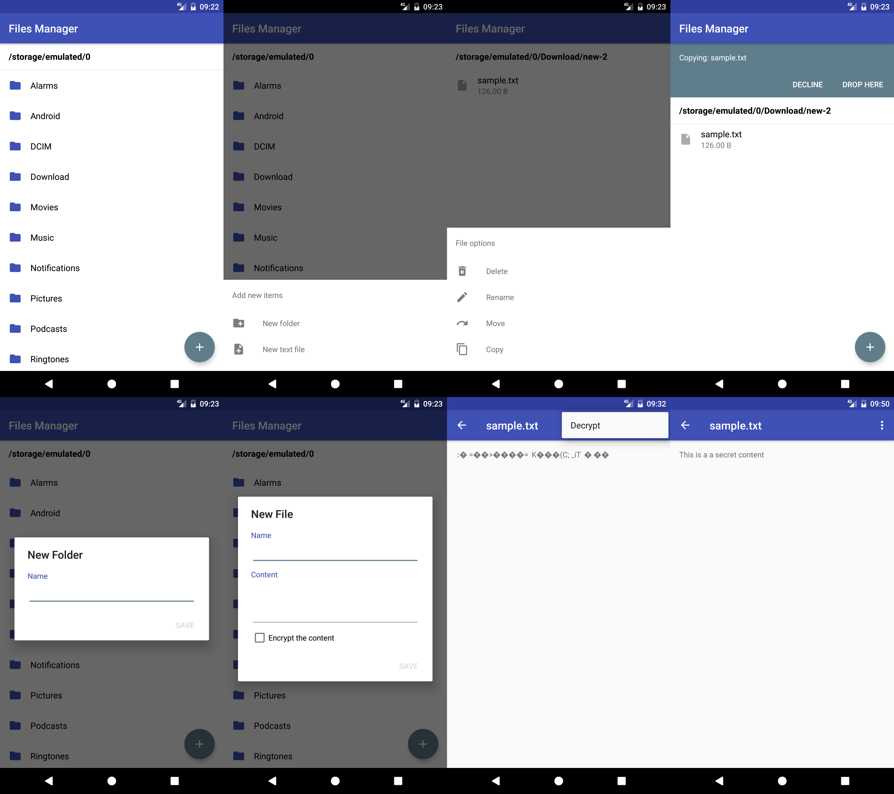

android-storage
======================

Library to create, read, delete, append, encrypt files and more, on internal or external disk spaces with a really simple API.

## Latest Release

[  ](https://bintray.com/sromku/maven/storage/_latestVersion)

``` groovy
dependencies {
    compile 'com.snatik:storage:2.1.0'
}
```

Don't forget to update `AndroidManifest.xml` and add next line:

``` xml
<uses-permission android:name="android.permission.WRITE_EXTERNAL_STORAGE" />
```

## Usage

``` java

// init
Storage storage = new Storage(getApplicationContext());

// get external storage
String path = storage.getExternalStorageDirectory();

// new dir
String newDir = path + File.separator + "My Sample Directory";
storage.createDirectory(newDir);
```

Check all options, scroll down ;)


## Sample app

The app has some simple UI screens and uses the storage library. This is just an example of what can be done with this lib.



## Options
* [Easy define Internal or External storage](#initialize)
* [Create directory](#create-directory)
* [Create file](#create-file)
* [Read file content](#read-file)
* [Append content to file](#append-content-to-file)
* [Copy](#copy)
* [Move](#move)
* [Delete directory](#delete-directory)
* [Delete file](#delete-file)
* [Get files](#get-files)
* [More options](#more)
* [Encrypt the file content](#security-configuration)

### Initialize

```
Storage storage = new Storage(getApplicationContext());
```

Work on **External Storage**.

- Check if external writable

	``` java
	boolean isWritable = storage.isExternalWritable();
	```

- Root external storage path

	``` java
	String path = storage.getExternalStorageDirectory();
	```

- If you want to use a particular public directory

    ``` java
    Storage storage = SimpleStorage.getExternalStorage(Environment.DIRECTORY_PICTURES);
    ```

Work on **Internal Storage**. 

- Directory for storing app internal files ([documentation](https://developer.android.com/training/basics/data-storage/files.html#WriteInternalStorage)):

	``` java
	String path = SimpleStorage.getInternalFilesDirectory();
	```
	
- Cache dir

	``` java
	String path = SimpleStorage.getInternalCacheDirectory();
	```
	
- Root internal storage dir

	``` java
	String path = SimpleStorage.getInternalRootDirectory();
	```

### Create directory

- Create directory

	``` java
	storage.createDirectory(path);
	```

- Create directory and **override** the existing one. 

	``` java
	storage.createDirectory(path, true);
	```

### Create file

Create a new file with the content in it.

``` java
storage.createFile(path, "some content of the file");
```

The `content` of the file can be one of the next types:
- `String`
- `byte[]`
- `Bitmap`
- `Storable`

### Read file

Read the content of any file to byte array.

``` java
byte[] bytes = storage.readFile(path);
```

Read the content of the file to String.
``` java
String content = storage.readTextFile(path);
```

### Append content to file
``` java
storage.appendFile(path, "more new data");
```

You can append:
- `String`
- `byte[]`

### Copy
``` java
storage.copy(fromPath, toPath);
```

### Move
``` java
storage.move(fromPath, toPath);
```

### Delete directory
``` java
storage.deleteDirectory(path);
```

### Delete file
``` java
storage.deleteFile(path);
```

### Get files
- Get files in ordered way by: `name`, `date`, `size`
	``` java
	List<File> files = storage.getFiles(path, OrderType.DATE);
	```

- Get files and filter by regular expression:
	``` java
	String regex = ...;
	List<File> files = storage.getFiles(path, regex);
	```

* Get all nested files (without the directories)
	``` java
	List<File> files = storage.getNestedFiles(path);
	```

### More...

* Is directory exists
	``` java
	boolean dirExists = storage.isDirectoryExists(path);
	```

* Is file exists
	``` java
	boolean fileExists = storage.isFileExist(path);
	```


## Security configuration
You can write and read files while the content is **encrypted**. It means, that no one can read the data of your files from external or internal storage.

You will continue using the same api as before. The only thing you need to do is to configure the Simple Storage library before the you want to create/read encrypted data.

``` java
// set encryption
String IVX = "abcdefghijklmnop"; // 16 lenght - not secret
String SECRET_KEY = "secret1234567890"; // 16 lenght - secret
byte[] SALT = "0000111100001111".getBytes(); // random 16 bytes array

// build configuratio
EncryptConfiguration configuration = new EncryptConfiguration.Builder()
	.setEncryptContent(IVX, SECRET_KEY, SALT)
	.build();
	
// configure the simple storage
storage.setEncryptConfiguration(configuration);
```

Now, you can create a new file with content and the content will be automatically encrypted.<br>
You can read the file and the content will be decrypted.

**Example**

Create file with next content `"this is the secret data"`:
``` java
storage.setEncryptConfiguration(configuration);
storage.createFile(path, "this is the secret data");
```

If we open the file to see it's content then it we will something like this: `„f°α�ΤG†_iΐp` . It looks good :)

And now, read the file data with the same api:
``` java
storage.setEncryptConfiguration(configuration);
String content = storage.readTextFile(path);
```
You will see that the content will be: `"this is the secret data"`.

## Tests

Just play and check the sample app ;)
