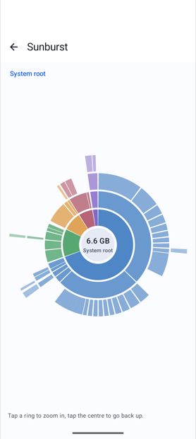
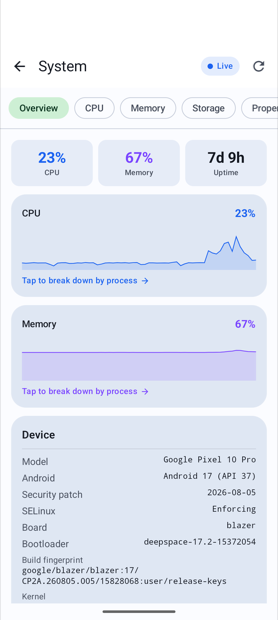
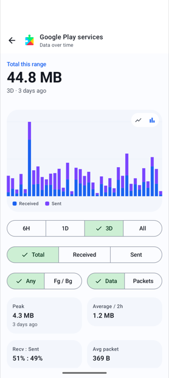

#  Storage Studio

A powerful **file, app, and system inspector for Android** - grown from the 2017
[`android-storage`](#the-library) library, which still ships underneath. Browse a phone like a file
manager, then keep going: inspect apps and APKs, read providers and databases, watch the intents and
broadcasts moving through the system, reclaim space - and drive the whole thing from an AI agent over
HTTP and MCP.

Kotlin · Jetpack Compose · Apache 2.0 · **[Full feature tour with screenshots →](https://sromku.com/storage-studio/)**

<p align="center">
  
  
  
</p>

## The story

`android-storage` began in 2017 as a small Java wrapper over `java.io.File`. Maintenance ended,
jcenter died, and it was archived while Android moved on a decade of API levels. It returns now as
something new: an app that spans everything from browsing your files to heavy, privileged, low-level
work - and a companion for building and validating your *own* apps. The library stays underneath,
rewritten in Kotlin, but the point now is the app, built for the AI age: everything it does is exposed
over an HTTP and [MCP](https://modelcontextprotocol.io) API so agents can drive the device directly.

## What it does

Depending on how much access you grant it, the app spans a lot of ground:

- **Browse & view** - file manager with search, sort and thumbnails; viewers for code, JSON/XML trees,
  images with EXIF, video/audio, PDF and fonts; a binary inspector (hex, strings, magic-byte types,
  protobuf); and a canvas renderer for Android vector drawables.
- **Measure & reclaim** - per-app app/data/cache sizes, a drillable **treemap** and **sunburst**, and
  storage insights (duplicates, empty dirs, zero-byte and ghost files). Time Machine forecasts when
  storage will fill.
- **Apps & APKs** - open any APK without installing (manifest, resources, signing, size sunburst),
  decompile dex to Java, inspect ELF binaries, and force-stop / clear / uninstall / (re)grant.
- **Read the device's data** - every content provider as a table (export CSV/JSON), a SQLite browser
  with a SQL console, editable shared preferences, a permission matrix and an app-ops timeline.
- **Watch & record** - live intent, broadcast, notification, clipboard and provider-change monitors;
  snapshot folders and diff them; record logcat, broadcasts, file changes and the screen.
- **For developers & agents** - build and send any intent, receive files over the network, and the
  Agent API below.

## Driven by an agent

The same engine behind the screens is a local server: **54 operations** over REST (`/api/v1/{op}`)
and MCP (`/mcp`), behind a bearer token and two safety gates (shell tools, device changes) - both off
by default, with an audit log.

```bash
adb forward tcp:8484 tcp:8484
curl -s localhost:8484/api/v1/apps -H "Authorization: Bearer $TOKEN"
```

## How far it reaches

Nothing is faked - each capability is honest about what it needs, and the app works at every tier.

| Capability | Needs |
|---|---|
| Browse your own app dirs, inspect any APK, list apps & components | **none** |
| All of shared storage, per-app storage sizes | **permission** (`MANAGE_EXTERNAL_STORAGE`, usage access) |
| Other apps' `Android/data`, debuggable-app private files, logcat, `pm`/`am`/`appops`, dumpsys | **[Shizuku](https://shizuku.rikka.app/)** (shell UID over ADB) |
| Any app's private `/data/data`, non-exported providers, partitions & swap | **root** |

**Starting Shizuku.** Enable **Wireless debugging** (Settings → Developer options), then in the
Shizuku app tap **Start via Wireless debugging** - no computer needed. Non-root Shizuku **stops on
every reboot**, so restart it after each restart; the app already holds the grant, so it reconnects
on its own. (The permission is tied to the app's signature, so re-grant once after switching between
the debug and Play builds.)

## The library

`com.snatik:storage` lives on as a thin, typed Kotlin module. Every operation returns `Result<T>`
(failures are a `StorageException`); calls block, so wrap them in `withContext(Dispatchers.IO)`.

```kotlin
val storage = Storage(context)
val file = "${storage.externalStorageDirectory}/notes.txt"
storage.createFile(file, "first line")
storage.appendLine(file, "second line")
storage.readTextFile(file).onSuccess { println(it) }

// AES-256-GCM, hardware-backed key that never leaves the device
val secure = Storage(context, Encryption.fromKeystore("my-files"))
```

Encryption uses a fresh random nonce per file, so identical content never produces identical bytes.
Requires `minSdk 28`.

## Architecture

Everything the UI can do is reachable from `core`, which is what the HTTP/MCP API calls:

- `core/fs` - file-system abstraction, volumes, operations, the disk scanner
- `core/apps` - package inspection and the binary XML decoder
- `core/data` - provider queries, the SQLite inspector, the preferences codec
- `core/intents` - intent model, sender, broadcast monitor, deep-link parsers
- `core/capture` - Room database, snapshots, diffs and the recording engine
- `core/net` - the Ktor server, peer discovery and the transfer client
- `core/shell` - the privilege layer and a `ShellExecutor` with plain, Shizuku and root backends

`app` is Compose only, with Navigation 3, Koin and Coil. The Shizuku binder is hand-written Kotlin -
no AIDL, no generated Java. Roadmap in [docs/PLAN.md](docs/PLAN.md).

## Building

JDK 17+ and the Android SDK (platform 37).

```bash
./gradlew :app:installDebug
```

## License

Apache 2.0 - see [LICENSE](LICENSE).
