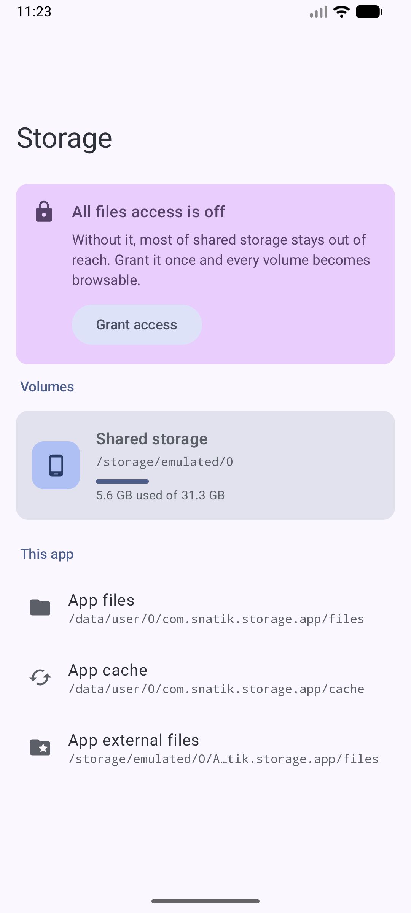
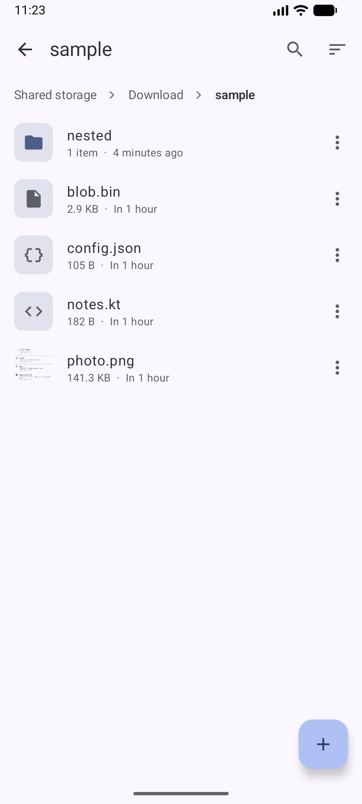
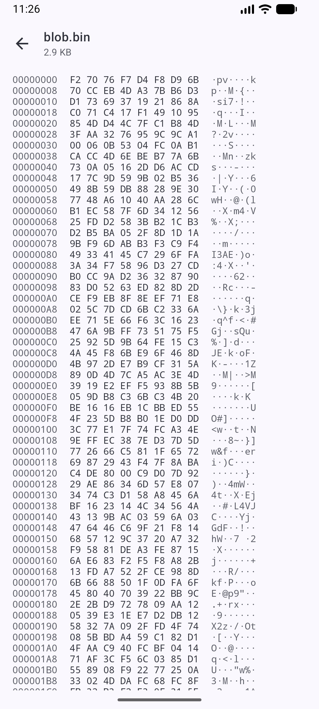

android-storage
======================

A small Kotlin library for files on Android: create, read, append, copy, move, delete, list, measure and encrypt on internal or external storage. Plus an app, being built on top of it, for exploring everything a device stores.

The library is `com.snatik:storage`. Version 3.0 is a Kotlin rewrite of the 2017 Java library; see [CHANGELOG.md](CHANGELOG.md) for what changed and [docs/PLAN.md](docs/PLAN.md) for where the project is going.

## Install

Maven Central publishing for 3.0.0 is being set up. Until then, include the `:storage` module from this repository.

```kotlin
dependencies {
    implementation("com.snatik:storage:3.0.0")
}
```

Requires minSdk 28.

## Usage

```kotlin
val storage = Storage(context)

val dir = storage.externalStorageDirectory.resolve("My Sample Directory").absolutePath
storage.createDirectory(dir)

val file = "$dir/notes.txt"
storage.createFile(file, "first line")
storage.appendLine(file, "second line")

storage.readTextFile(file)
    .onSuccess { println(it) }
    .onFailure { error -> println("could not read: $error") }
```

Every operation returns `Result<T>`. A failure is always a `StorageException`:

| Exception | Meaning |
|---|---|
| `NotFound` | the path does not exist |
| `AlreadyExists` | the path exists and the operation refuses to overwrite |
| `NotADirectory` / `NotAFile` | wrong kind of path |
| `Io` | the file system refused; the cause is attached |
| `Crypto` | wrong key, tampered data or unknown format |
| `Unsupported` | not available in this configuration |

Calls block the calling thread. Wrap them in `withContext(Dispatchers.IO)` from a coroutine.

### Locations

```kotlin
storage.externalStorageDirectory            // /storage/emulated/0
storage.externalPublicDirectory(Environment.DIRECTORY_PICTURES)
storage.externalFilesDirectory              // Android/data/<pkg>/files, or null
storage.internalFilesDirectory              // /data/user/0/<pkg>/files
storage.internalCacheDirectory
storage.isExternalWritable
```

Browsing shared storage on Android 11 and later needs `MANAGE_EXTERNAL_STORAGE` or the Storage Access Framework. Your own directories need nothing.

### Directories

```kotlin
storage.createDirectory(path)                       // parents created, fails if it exists
storage.createDirectory(path, override = true)      // wipes an existing directory first
storage.deleteDirectory(path)
storage.listFiles(path)
storage.listFiles(path, nameMatches = Regex(".*\\.txt"), order = FileOrder.NEWEST_FIRST)
storage.listFilesRecursively(path)                  // every regular file below path
storage.directorySize(path)                         // Result<Long>
```

`FileOrder`: `NAME`, `NEWEST_FIRST`, `SMALLEST_FIRST`, `LARGEST_FIRST`, `DIRECTORIES_FIRST`.

### Files

```kotlin
storage.createFile(path, "text")
storage.createFile(path, byteArray)
storage.createFile(path, bitmap, Bitmap.CompressFormat.JPEG, quality = 90)
storage.createFile(path, Storable { myObject.serialize() })
storage.readFile(path)          // Result<ByteArray>
storage.readTextFile(path)      // Result<String>
storage.appendFile(path, bytes)
storage.appendLine(path, "a line")
storage.deleteFile(path)
storage.exists(path); storage.isFile(path); storage.isDirectory(path)
```

### Copy, move, rename

```kotlin
storage.copy(from, to)      // file or whole directory tree, replaces existing files
storage.move(from, to)      // rename when possible, otherwise copy then delete
storage.rename(from, to)    // fails if `to` exists
```

### Sizes

```kotlin
storage.size(path, SizeUnit.MB)         // Double
storage.readableSize(path)              // "1.5 MB"
storage.freeSpace(path, SizeUnit.GB)
storage.usedSpace(path)
storage.totalSpace(path)
1536L.toReadableSize()                  // "1.5 KB"
```

### Encryption

Pass an `Encryption` to `Storage` and every `createFile` encrypts, every `readFile` decrypts. The scheme is AES-256-GCM with a fresh random nonce per file, so identical content never produces identical bytes and any tampering is detected.

```kotlin
// Hardware-backed key that never leaves the device
val secure = Storage(context, Encryption.fromKeystore("my-files"))

// Or a passphrase. Generate the salt once and keep it next to your data.
val salt = Encryption.generateSalt()
val secure = Storage(context, Encryption.fromPassphrase("correct horse".toCharArray(), salt))

// Or a raw 16, 24 or 32 byte key
val secure = Storage(context, Encryption.fromKey(keyBytes))

secure.createFile(path, "secret")
secure.readTextFile(path)               // "secret"
Storage(context).readTextFile(path)     // ciphertext, not readable
```

`appendFile` is not available on encrypted storage, since an encrypted file is one authenticated message. Files written by the 2.x library (AES-CBC) cannot be read by 3.0.

## The app

The `app` module is a Jetpack Compose file explorer and the foundation of a device inspection tool: storage statistics, app and manifest inspection, content provider and database browsing, intent tooling, snapshots, transfers and an HTTP and MCP API for agents. The roadmap is in [docs/PLAN.md](docs/PLAN.md).

What it does today:

- Volumes overview with usage, plus the app's own directories.
- Browse any directory with breadcrumbs, search, sort by name, date, size or type, and hidden files toggle.
- Thumbnails for images and videos, typed icons for everything else.
- Multi-select with copy, move, delete and share. Rename, new folder, new file. Operations run in the background with progress and cancel.
- Details sheet with path, size, permissions and on-demand SHA-256.
- Viewers per file type: syntax-highlighted code and text, a JSON and an XML tree, hex with an ASCII column, images with pinch zoom and an EXIF sheet, an APK inspector that reads any package file without installing it, and a zip archive browser.
- Shell access through [Shizuku](https://shizuku.rikka.app/): browse the system root, other apps' `Android/data`, and the private data of your own debuggable apps via `run-as`. Root is used instead when the device has it and you turn it on.
- Network: a live view of which apps are talking to the network, with remote host (reverse-DNS), port, connection state and per-app byte totals, read from the kernel connection tables through the shell. No VPN needed. Reachable from Tools or from an app's overview.
- Device dashboard: a health view of the phone — model, Android release and API level, security patch, build and kernel, SELinux mode, uptime, RAM in use, battery level, temperature and health, and ZRAM swap, with the top kernel wakelocks. In Tools.
- Permission matrix: every installed app as a row against the dangerous permissions as columns, each cell showing granted or merely requested, so an outlier stands out at a glance. In Tools.
- App-ops timeline: the most recent sensitive access across every app — location, camera, mic, Bluetooth and Wi-Fi scans, clipboard — newest first, with a filter for the sensitive ones. Reads the device-wide app-ops log through the shell. In Tools.
- Global search: find files by name or grep their text content anywhere on the device, choosing shared storage, the system root or app data. Uses the shell's `find` and `grep` to reach privileged paths, and falls back to walking the file system without one. In Tools.
- Notification monitor: with notification access granted, logs every notification posted device-wide — package, title, text, time, and whether it is ongoing — newest first. In Tools.
- Provider watch: register change observers on well-known content providers (media, contacts, SMS, call log, calendar, settings) and see each change as it is broadcast, with the exact URI. In Tools.
- Clipboard: read the current clipboard and keep a session history of what passes through it. Android 10+ only exposes the clipboard to the foreground app, so this captures while the screen is open. In Tools.
- Sunburst: a drillable radial chart of where space goes under any folder, with a breadcrumb. Tap a ring to zoom in, tap the centre to go back up. Reached from the disk-usage screen.
- Storage insights: scan a location for reclaimable space — duplicate files (grouped by size, confirmed by SHA-256), empty directories, zero-byte files, and ghost footprints left under Android/data and Android/obb by apps that are no longer installed. In Tools.
- App storage breakdown: decompose an installed app's footprint into its base APK, split APKs, compiled OAT/ART artifacts, native libraries, and private data, cache and external data, as a stacked bar with sizes and shares. From an app's overview.
- App behavior: for any app, a Behavior tab shows what it actually did — location, Bluetooth and Wi-Fi scans, camera, mic, clipboard and contacts access with timestamps from app-ops, its running services and processes, recently changed files, and a suspicion score that rolls the signals up. Needs shell access.
- Apps tab: every package with app, data and cache sizes (usage access), filters for user, system and debuggable, sort by name, size or last update.
- App detail: storage breakdown, install facts, signing certificate, the decoded `AndroidManifest.xml` with search, components with exported flags, requested permissions with grant state. With a shell: force stop, clear cache or data, uninstall, and grant or revoke runtime permissions.
- Disk usage: scan any folder into a treemap you can drill into, plus the largest files. Works through the shell for privileged paths.
- Data tab: every content provider on the device with its permissions, shortcuts for MediaStore, contacts, call log, SMS, calendar and settings. Query any URI with projection, selection, sort and paging, export the result as CSV or JSON. Providers the app may not read are queried as the shell user when Shizuku is connected.
- SQLite: open any database the current access tier can reach, including a debuggable app's private one. Tables with row counts, schema, sortable paged rows, and a SQL console. Databases that cannot be opened in place are copied and can be saved back.
- Shared preferences: open the XML of any app you can reach, edit typed values, add or delete keys, save back.
- Capture tab: freeze any folder into a snapshot with sizes, mtimes, optional hashes and optional copies, then compare two snapshots into added, removed, modified and moved files with a line diff for text. Recording sessions capture logcat (through the shell, filtered by package or spec), broadcasts, file changes and optionally the screen, run as a foreground service, and export as a zip.
- Agent API: the same server exposes 16 operations over REST (`/api/v1/{op}`) and Model Context Protocol (`/mcp`), so Claude Code and other tools can list apps, read files, decode a manifest, query a provider, run SQL, take a snapshot or run a shell command on the phone. Behind a bearer token and two safety gates (shell tools and device changes), both off by default, with an audit log. Connect with `adb forward tcp:8484 tcp:8484` and one MCP config block.
- Receive files: an embedded HTTP server with a browser drop page, a pairing code and a QR code. Works over Wi‑Fi or through `adb forward tcp:8484 tcp:8484` from a laptop. Other phones running the app appear over the network and can send files with resume; a manual host:port works too.
- Intents tab: build any activity, broadcast or service intent with typed extras and flags, see which components would receive it, send it or save it as a preset. An optional intent sink appears in share sheets and link choosers, logs every intent it receives with all extras, and forwards it on. A live broadcast monitor, the system's recent broadcast history from dumpsys (shell), and a deep-link tester that shows every app claiming a URL.

<p>



</p>

Architecture: `core/fs` holds the file system abstraction, volumes, operations and the disk scanner; `core/apps` holds package inspection and the binary XML decoder; `core/data` holds provider queries, the SQLite inspector and the preferences codec; `core/intents` holds the intent model, sender, sink log, broadcast monitor and history parser; `core/capture` holds the Room database, snapshots, diffs and the recording engine; `core/net` holds the Ktor server, peer discovery and the transfer client; `core/shell` holds the privilege layer, a `ShellExecutor` with plain, Shizuku and root backends and a shell-backed file system, all without UI dependencies. The Shizuku side is a hand-written Kotlin `Binder`, so there is no AIDL and no generated Java. `app` is Compose only with Navigation 3, Koin and Coil. Everything the UI can do is reachable from `core`, which is what the HTTP and MCP API will call later.

## Building

JDK 17 or newer and the Android SDK with platform 37.

```
./gradlew build
./gradlew :app:installDebug
```

## License

Apache 2.0, see [LICENSE](LICENSE).
